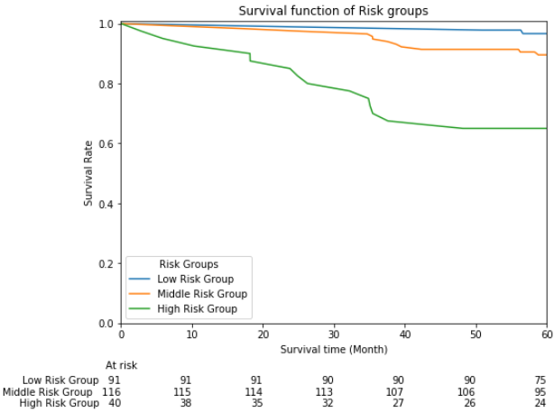
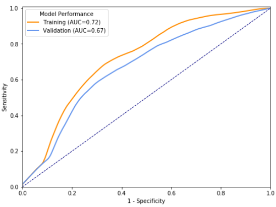
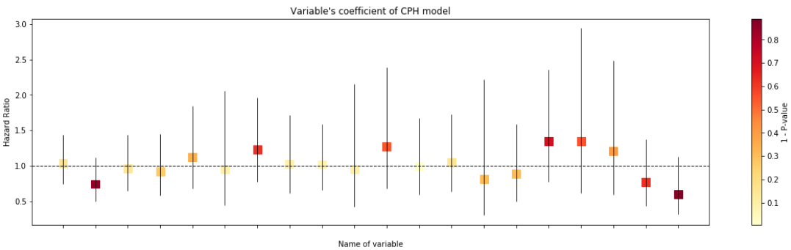

# PLSA

 

A Python Library of Statistical Analyze for using in my private workflow.

# Introduction

This project is a Python Library of Statistical Analyze(PLSA). 

The library collects files generated in my routinue, and motivation of it is mainly reusing. Have to mention that this package would be suitable for people working in field of medical statistical analysis.

This library will be updated and released as a standard Python Pypi Packages.

Functions in the package is summarized below respectively:

- data
    - processing: process data used in survival analyze.
- qcal
    - func: integrate functions of other mudules, mainly for calling freely.
- surv
    - cutoff: get optimal cutoffs according different criterion in survival analyze.
    - utils: include general function in survival analyze.
- utils
    - cutoff: get optimal cutoffs according different criterion in general case.
    - metrics: evaluate models by some metrics.
    - test: include methods of hypothetical test.
    - write: save and output formatted PMML file converted from sklearn model.
- vision
    - calibration: visualize calibration curve.
    - roc: visualize ROC curve.
    - survrisk: visualize survial function of different risk-groups.
    - lib: include general function in plotting figure.

# Read Docs

Reference for PLSA : [Docs for PLSA](http://plsa.readthedocs.io/)

# News

- Version 0.2 is released.
- Support for ploting forest of coefficient in CPH model

# Examples

### 1.Divive data into three groups according to cutoff (ct1, ct2)

```python
from PLSA.qcal.func import div_three_groups

div_three_groups(data, 'pred_risk', 'T', 'E', cutoffs=(CT1, CT2), labels=['Low', 'Middle', 'High'])
# print summary below and result of log-rank test
# _________________Result of division__________________
# Cut-off: Low vs Middle  = 46.0023173231
#          Middle vs High = 66.4397701135
# Number of low risk group : 91
#           middle risk group : 116
#           high risk group : 40
# High-Risk vs Middle-Risk :
# <lifelines.StatisticalResult:
# ...
# >
# Middle-Risk vs Low_Risk :
# <lifelines.StatisticalResult: 
# ...
# >
```



### 2.Curve of Time-Dependent ROC and Calibration is also available

```python
from PLSA import surv

# Given pt=120 for predictive time
train_roc = surv.get_surAuc(data['pred'].values, data['T'].values, data['E'].values, pt=120)
test_roc  = surv.get_surAuc(data_test['pred'].values, data_test['T'].values, data_test['E'].values, pt=120)

# Plot and save files
vision.plt_twoSurvROC(train_roc, test_roc, filename="AUC120.png")
# Print summary below
# __________________AUC____________________
# AUC on train set : 0.719112524405
# AUC on test  set : 0.670286957204
```



### 3.Forest of coefficents from `lifelines`'s CPH model

```python
from lifelines import CoxPHFitter
from PLSA.vision.lib import plot_cphCoef

cph = CoxPHFitter()
cph.fit(data, duration_col='T', event_col='E')

# cph.summary as parameter
# Plot hazard ratio of each variable in setting of error_bar='hr'
plot_cphCoef(cph.summary, error_bar='hr', figsize=(20, 5))
```

Color shade of square dots correlated to P-value of variables
